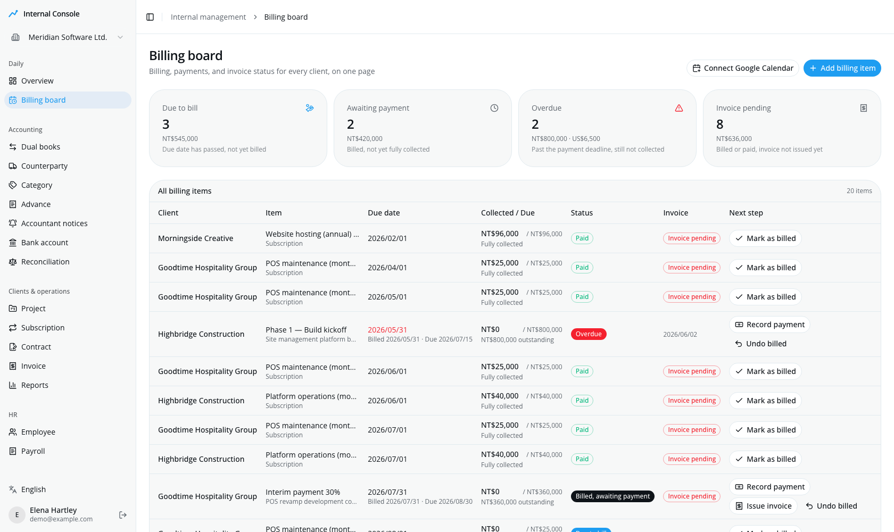
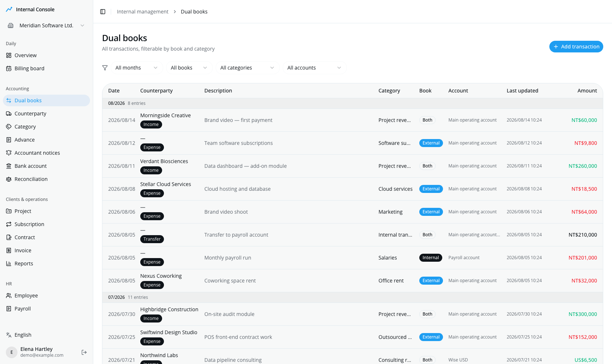
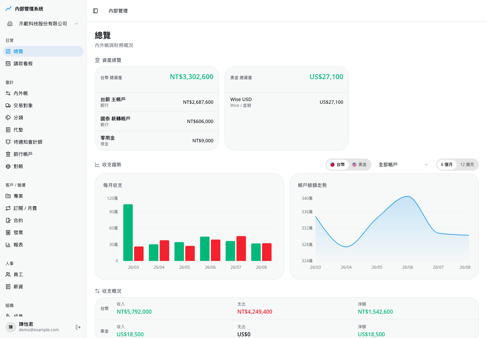
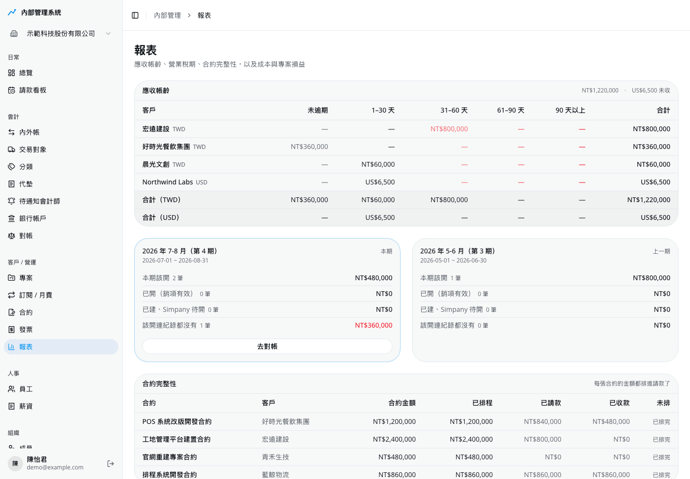

<p align="center">
  
</p>

<p align="center">
  <a href="./LICENSE"></a>
  
</p>

<h1 align="center">Pathors Internal</h1>

<p align="center">
  <b>Self-hosted internal accounting (內外帳) &amp; client-finance management for small companies.</b><br/>
  One deployment serves many organizations, with every row scoped by <code>organization_id</code>.
</p>

---

It keeps two sets of books — *internal* and *external* (內外帳) — in one ledger, and tracks
the money owed to you on the other side: projects, contracts, subscriptions, invoices and
who still hasn't paid. It's the in-house tool we run ourselves, not a general-purpose ERP.

The UI ships in English and Traditional Chinese (zh-TW), switchable per user from the
sidebar. The codebase, docs and configuration are English.

---

## What it looks like

> Screenshots are from a demo organization — the company, clients and figures are all made up.

There is also a standalone [landing page](docs/landing/index.html) that walks through the same
ideas — open the file in a browser, or serve `docs/` with GitHub Pages.

<table>
  <tr>
    <td width="50%" valign="top">
      
      <p><b>Billing board</b> — one page for the whole billing cycle.<br/>
      <sub>Who should be billed, who has been billed, who still owes you. One-off
      contract instalments and recurring subscription periods merge into a single
      list, and every row carries its next action.</sub></p>
    </td>
    <td width="50%" valign="top">
      
      <p><b>Dual books</b> — the internal / external ledger.<br/>
      <sub>Every transaction carries a <code>book</code> tag, so both views come from
      the same records instead of two spreadsheets that drift apart. Filter by month,
      book, category or account.</sub></p>
    </td>
  </tr>
  <tr>
    <td width="50%" valign="top">
      
      <p><b>Overview</b> — where the money actually is.<br/>
      <sub>Balances per account and per currency with no implicit FX conversion,
      monthly income against expense, and the balance trend.</sub></p>
    </td>
    <td width="50%" valign="top">
      
      <p><b>Reports</b> — receivables, tax periods, contract coverage.<br/>
      <sub>Ageing buckets per client, what each VAT period still needs invoiced, and a
      check that every contract's value has actually been scheduled into billable items.</sub></p>
    </td>
  </tr>
</table>

## Features

- **Multi-tenancy** — one deployment, many organizations, via the
  [better-auth](https://better-auth.com) organization plugin. Every row is scoped by
  `organization_id`, with an org switcher and owner/admin roles.
- **Dual books (內外帳)** — a `book` field on every transaction separates the internal and
  external ledgers.
- **Accounting core** — transactions, categories, bank accounts, counterparties,
  reconciliation, advances and reimbursements.
- **Client finance** — projects, contracts (with instalment schedules), subscriptions and
  receivables.
- **Billing board (請款看板)** — contract instalments and subscription periods merged into
  one actionable list.
- **Google Calendar** — billing, collection and invoicing dates are pushed to a dedicated
  reminder calendar, so the nagging comes from Google. No cron needed.
- **Payroll** — employees, payroll item types and pay runs.
- **Reports** — receivables ageing, VAT periods, contract coverage, cost and project P&L.
- **Documents** — file uploads to object storage (e.g. receipts attached to transactions).
- **MCP** — the ledger is also exposed as an MCP server, so an AI agent can query and record
  against it. See [`docs/mcp.md`](docs/mcp.md).
- **Bilingual UI** — English and Traditional Chinese, switched per user without
  reloading or changing URLs. See [Internationalization](#internationalization).
- **Auth** — Google OAuth via better-auth, invite-based member management, org settings.

## Tech stack

| Layer | Choice |
| --- | --- |
| Frontend | Next.js 16 (App Router), React 19, Tailwind CSS v4, shadcn/ui + Base UI |
| i18n | next-intl (cookie-based locale, no URL segment) |
| Backend | Next.js Route Handlers / Server Actions, better-auth |
| Database | Postgres + Drizzle ORM (introspect-only schema, plain-SQL migrations) |
| Tooling | Bun |

Nothing is tied to a specific host — it's a standard Next.js + Postgres app. Where *we*
happen to run it is just one option; see [Deployment](#deployment).

---

## Quick start

**Prerequisites:** [Bun](https://bun.sh), a Postgres database, and Google OAuth credentials.

```bash
bun install
```

```bash
cp .env.example .env.local      # DATABASE_URL, BETTER_AUTH_SECRET, Google OAuth…
```

```bash
bun dev                          # http://localhost:3000
```

Generate `BETTER_AUTH_SECRET` with `openssl rand -base64 32`. For Google OAuth, create a
"Web application" OAuth client and add `http://localhost:3000/api/auth/callback/google` as
an authorized redirect URI (add your production URL before deploying).

The first user to sign in lands on `/onboarding`. To make someone the owner of an existing
organization, edit `v_email` in [`scripts/bootstrap-owner.sql`](scripts/bootstrap-owner.sql)
and run it against your database.

## Configuration

| Variable | Purpose |
| --- | --- |
| `DATABASE_URL` | Postgres connection string (pooled) |
| `BETTER_AUTH_SECRET` | Session signing secret (`openssl rand -base64 32`) |
| `BETTER_AUTH_URL` | App base URL, no trailing slash |
| `GOOGLE_CLIENT_ID` / `GOOGLE_CLIENT_SECRET` | Google OAuth credentials (sign-in **and** the optional Google Calendar integration) |

See [`.env.example`](.env.example) for the full template.

---

## Internationalization

The UI ships in **English** and **Traditional Chinese (zh-TW)**. Readers switch locale from
the sidebar; the choice is stored in a `locale` cookie.

There is deliberately **no locale segment in the URL** — `/billing` is `/billing` in every
language. That keeps the auth callbacks, the MCP endpoints and every bookmark stable.

```
src/i18n/
  config.ts            # locale list, default, cookie name
  request.ts           # next-intl request config
  messages/
    dictionary.ts      # Leaf / Dictionary types + locale projection
    <area>.ts          # one file per area, all locales side by side
```

Every string carries its translations together, rather than living in parallel per-locale
trees:

```ts
const dashboard = {
  title: { "zh-TW": "總覽", en: "Overview" },
} satisfies Dictionary;
```

A key missing a locale — or carrying a misspelled one — is a **build error**, not a string
that silently falls back. Keeping both languages on the same key also makes a gap visible
where you are already reading, and means adding a locale is a compiler-guided edit rather
than a diff between two files. Translations are read with
[next-intl](https://next-intl.dev) — `useTranslations()` in Client Components,
`await getTranslations()` in Server Components and Server Actions. Server Actions translate
their own validation errors, so a message that surfaces in a toast is in the same language as
the page that triggered it.

To add a locale: add it to `locales` in `src/i18n/config.ts` and let TypeScript walk you
through every key that now needs a translation.

---

## Database

Postgres through **Drizzle ORM**. `src/db/schema.ts` is introspected from the database
(`bun run db:pull`) — the app never pushes schema — and everything under
[`migrations/`](migrations) is plain forward-only SQL. There is no vendor-specific SQL, so
**any Postgres works**.

The Drizzle client lives in [`src/db/index.ts`](src/db/index.ts) — point `DATABASE_URL` at
your database and you're set. Which Postgres *driver* to use is the only runtime-dependent
choice (a TCP driver like `node-postgres` on a normal server; an HTTP driver where you can't
open TCP). That single swap is covered in the
[deployment guide](docs/deployment.md#database-driver).

> `migrations/` is a forward-only history for an existing database, not a bootstrap for an
> empty one. How you evolve schema, branch your database or roll out migrations is up to
> your own workflow — this project does not prescribe one.

## Deployment

Build it (`bun run build`) and run it like any other Next.js app, anywhere that can serve
Next.js and reach a Postgres database. The repo prescribes no host.

The **[deployment guide](docs/deployment.md)** walks through two concrete setups as examples
— a **Docker self-host** (vendor-neutral Node + Postgres, with a [`Dockerfile`](Dockerfile)
and [`docker-compose.yml`](docker-compose.yml)), and the serverless setup *we* happen to run
— but neither is a requirement.

---

## Project structure

```
src/
  app/            # Next.js App Router (dashboard pages, auth routes, onboarding)
  components/     # UI components (shadcn/ui + Base UI) and shared widgets
  db/             # Drizzle client, introspected schema, queries & mutations
  i18n/           # locale config and bilingual message catalogue
  lib/            # auth (better-auth), session helpers, object storage, utils
migrations/       # plain forward-only SQL migrations
scripts/          # one-off operational SQL (e.g. bootstrap-owner)
docs/             # deployment guide, MCP docs, landing page, README assets
Dockerfile        # vendor-neutral self-host image
docker-compose.yml
```

## Contributing

Issues and pull requests are welcome — please use [GitHub Issues](../../issues) for bugs and
feature requests. User-facing strings must go through i18n rather than being hardcoded —
see [Internationalization](#internationalization) for where the message files live.

## License

Licensed under the [Apache License 2.0](./LICENSE). You're free to use, modify and
redistribute it, including commercially — just retain the license and copyright notices.
