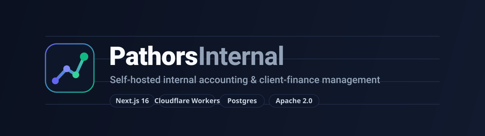
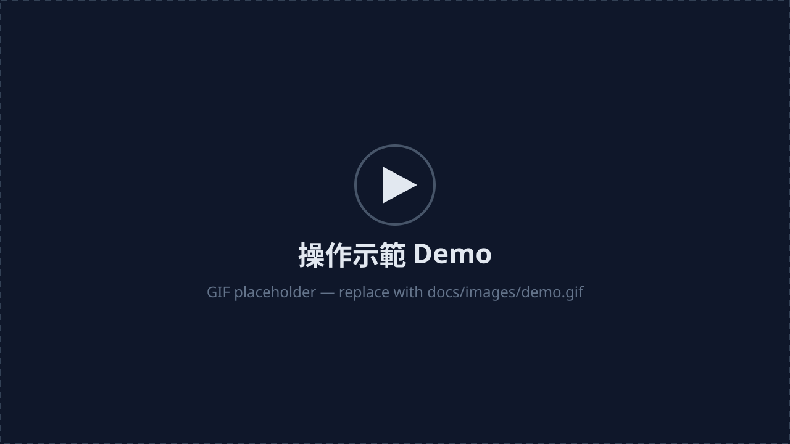
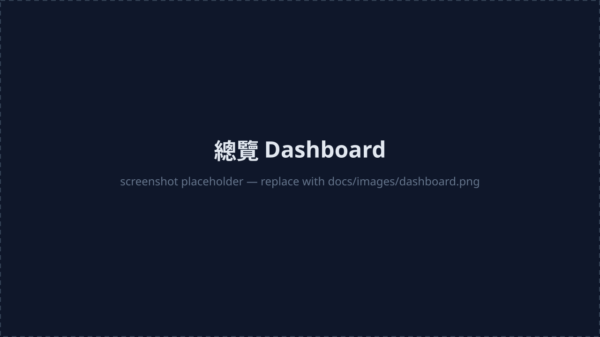
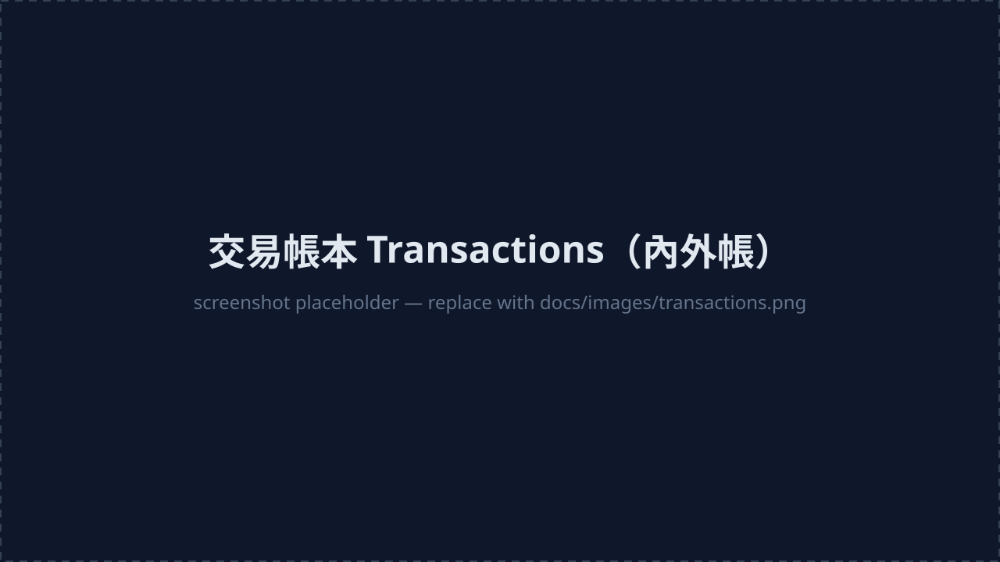
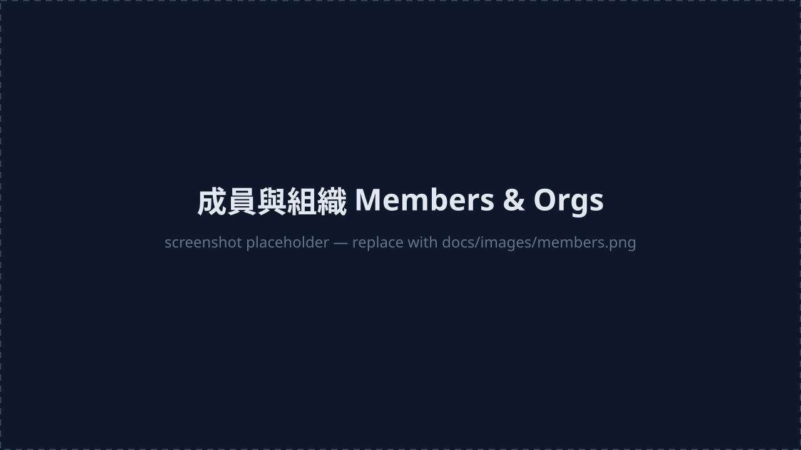

<p align="center">
  
</p>

<p align="center">
  <a href="./LICENSE"></a>
  <a href="https://nextjs.org"></a>
  <a href="https://workers.cloudflare.com"></a>
  <a href="https://www.postgresql.org"></a>
  
</p>

<h1 align="center">Pathors Internal</h1>

<p align="center">
  <b>Self-hosted, multi-tenant bookkeeping for small companies.</b><br/>
  One deployment serves many organizations, with data isolated per <code>organization_id</code>.
</p>

> **Note** — the application UI is in **Traditional Chinese (zh-TW)**. The codebase, docs, and configuration are in English. It is designed for small Taiwanese companies that keep both *internal* and *external* books (內外帳), but the data model is generic enough for any small-business ledger.

---

## Screenshots

> Placeholders for now — swap the `.svg` files in `docs/images/` for real (anonymized) screenshots / a GIF later.

<p align="center">
  
</p>

| Dashboard | Transactions (內外帳) |
| --- | --- |
|  |  |

| Reports | Members & Organizations |
| --- | --- |
|  |  |

<!--
To use real screenshots: drop .png / .gif files into docs/images/ and switch the
.svg references above to .png / .gif:
  docs/images/demo.gif          suggested: the "create a transaction" flow
  docs/images/dashboard.png     overview page
  docs/images/transactions.png  ledger list (book tags, filters)
  docs/images/reports.png       reports page
  docs/images/members.png       member management + org switcher
Capture with fake data (e.g. a demo org on a local/dev database) to avoid leaking real data.
-->

---

## Features

- **Multi-tenancy** — powered by the [better-auth](https://better-auth.com) organization plugin. A single deployment hosts many orgs; every row is scoped by `organization_id`, with a built-in org switcher and owner/admin roles.
- **Dual books (內外帳)** — each transaction carries a `book` field separating internal vs. external ledgers.
- **Bookkeeping core** — transactions, categories, bank accounts, counterparties, reconciliation, and advances/reimbursements.
- **Client operations** — projects, subscriptions, contracts, and accounts receivable.
- **Payroll** — employees, payroll item types, and pay runs.
- **Reports** — aggregated income/expense and receivables views.
- **Documents** — file uploads stored in Cloudflare R2.
- **Auth** — Google OAuth via better-auth; invite-based member management; org settings (rename / delete).

## Tech stack

| Layer | Choice |
| --- | --- |
| Frontend | Next.js 16 (App Router), React 19, Tailwind CSS v4, shadcn/ui + Base UI |
| Backend | Next.js Route Handlers / Server Actions, better-auth |
| Database | Postgres + Drizzle ORM (introspect-only schema, plain-SQL migrations) |
| Hosting | Cloudflare Workers (via [OpenNext](https://opennext.js.org)), Cloudflare R2 for files |
| Tooling | Bun |

---

## Quick start

**Prerequisites:** [Bun](https://bun.sh), a Postgres database, and Google OAuth credentials.

```bash
# 1. Install
bun install

# 2. Configure
cp .env.example .env.local      # fill in DATABASE_URL, BETTER_AUTH_SECRET, Google OAuth…

# 3. Run
bun dev                          # http://localhost:3000
```

Generate `BETTER_AUTH_SECRET` with `openssl rand -base64 32`. For Google OAuth, create a "Web application" OAuth client and add `http://localhost:3000/api/auth/callback/google` as an authorized redirect URI (add your production URL before deploying).

The first user to sign in lands on `/onboarding`. To make someone the owner of an existing organization, edit `v_email` in [`scripts/bootstrap-owner.sql`](scripts/bootstrap-owner.sql) and run it against your database.

## Configuration

| Variable | Purpose |
| --- | --- |
| `DATABASE_URL` | Postgres connection string (pooled) |
| `BETTER_AUTH_SECRET` | Session signing secret (`openssl rand -base64 32`) |
| `BETTER_AUTH_URL` | App base URL, no trailing slash |
| `GOOGLE_CLIENT_ID` / `GOOGLE_CLIENT_SECRET` | Google OAuth credentials |

See [`.env.example`](.env.example) for the full template.

---

## Database

This app uses **Postgres** through **Drizzle ORM**. Everything under [`migrations/`](migrations) is plain forward-only SQL, and `src/db/schema.ts` is introspected from the database (`bun run db:pull`) — the app never pushes schema. There is no vendor-specific SQL, so **any Postgres works**.

By default it uses **Neon's** serverless (HTTP) driver, because the app deploys to **Cloudflare Workers**, where you can't open a normal TCP connection and need an HTTP-based driver. This is not a hard dependency — to use any other Postgres or runtime, change one file:

- Swap the driver in [`src/db/index.ts`](src/db/index.ts):
  - Plain Node host → `drizzle-orm/node-postgres` (`pg`) or `drizzle-orm/postgres-js`.
  - Other serverless platforms → their respective serverless driver.
- With a driver that supports interactive transactions, you can remove `transaction: false` in [`src/lib/auth.ts`](src/lib/auth.ts).
- Point `DATABASE_URL` at your Postgres.

> How you evolve schema, branch your database, or roll out migrations is up to your own workflow — this project does not prescribe one.

## Deployment

The project deploys to **Cloudflare Workers** via OpenNext.

```bash
cp wrangler.jsonc.example wrangler.jsonc   # first time: fill in your own values
bun run cf:deploy
```

`wrangler.jsonc` is gitignored (it holds account-specific values). In it:

- `account_id` — set it here, or omit it and export `CLOUDFLARE_ACCOUNT_ID` (wrangler reads it natively).
- `routes` — your custom domain; delete the block to deploy on `*.workers.dev` only.
- `r2_buckets[].bucket_name` and `name` (worker name) — set your own.

---

## Project structure

```
src/
  app/            # Next.js App Router (dashboard pages, auth routes, onboarding)
  components/     # UI components (shadcn/ui + Base UI) and shared widgets
  db/             # Drizzle client, introspected schema, queries & mutations
  lib/            # auth (better-auth), session helpers, storage (R2), utils
migrations/       # plain forward-only SQL migrations
scripts/          # one-off operational SQL (e.g. bootstrap-owner)
docs/images/      # README assets
```

## Contributing

Issues and pull requests are welcome — please use [GitHub Issues](../../issues) for bugs and feature requests. Note that user-facing strings are Traditional Chinese (zh-TW); please keep new UI copy consistent.

## License

Licensed under the [Apache License 2.0](./LICENSE). You're free to use, modify, and redistribute it, including commercially — just retain the license and copyright notices.
